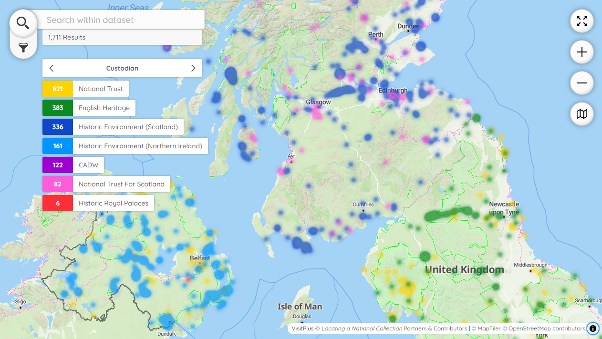
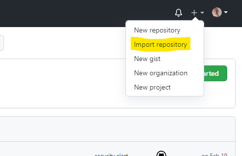
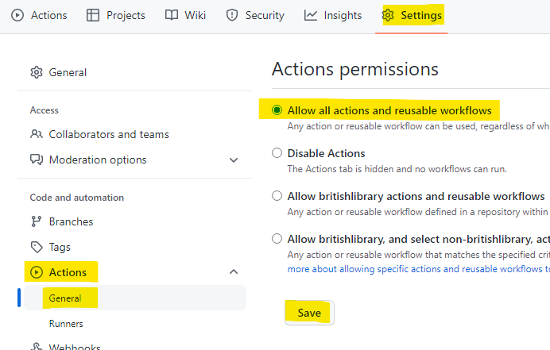

# What is *Peripleo*?

*Peripleo* is a browser-based tool for the mapping of things related to place. Originally an initiative of the [Pelagios Network](https://pelagios.org/), it was developed early in 2022 as part of the British Library's [**Locating a National Collection**](https://britishlibrary.github.io/locating-a-national-collection/) project (LaNC) for the discovery and spatial visualisation of collection data. LaNC was a Foundation project within the AHRC-funded [Towards a National Collection Programme](https://www.nationalcollection.org.uk/).

)
Example of *Peripleo* in action: LaNC *VisitPlus* dataset.

##  Embedding Maps

Maps made using *Peripleo* can be embedded in other web sites, wikis, and blogs using IFrames. See [here](./Configuration-Guide.md#-embedding-your-map) for some tips on how to do this.

# Installation Guide

##  What you need to get started

* Dataset(s) formatted as [Linked Places Format (LPF)](https://github.com/LinkedPasts/linked-places-format/blob/master/README.md) or GeoJSON. These are not complicated formats, and are described [here](./json-and-the-archonauts.md). If your data is in a spreadsheet or delimited text (for example CSV), you will need to convert it using a tool such as [Locolligo](https://github.com/docuracy/Locolligo/blob/main/README.md).
* Somewhere to host and serve a simple HTML file, together with any datasets not hosted elsewhere. This guide continues with instructions for hosting your map on GitHub Pages: you might instead copy the files from the `docs` folder to another server and go straight to the [Configuration Guide](./Configuration-Guide.md).

##  Setting up GitHub Pages

1. If you do not already have a GitHub account, go to https://github.com/signup and create one.
2. Sign in to GitHub.
3. Click on `Import Repository`.

    

4. Type `https://github.com/britishlibrary/peripleo` as your 'old repository's clone URL'.
5. Type a name for your new repository (perhaps related to the specifics of the map you are going to create), and decide whether to make it Public or Private.
6. Click on `Begin Import`, and wait for the process to complete.
7. Open your new repository either by clicking on the link shown when import completes, or by following the link to 'Your repositories' revealed by clicking on your name-badge icon, top-right.
8. Click on `Settings`, `Actions` and `General`.

    

9. In the 'Actions permissions' section, select `Allow all actions and reusable workflows` and click on `Save`.
10. Click on `Pages`.
11. In the 'Source' section, click on 'None' and select `Main`; next to that, select folder `/docs` in the drop-down list.
12. Click on `Save`.
13. The system will then give you the URL on which your site is published. **Please note that now and at every time you edit your site it may take a few minutes for it to be (re-)built and deployed before the changes are evident**. You can see progress by clicking on `Actions`. 
14. You can now check that *Peripleo* is running correctly with the default example configuration.
15. If you are familiar with the procedure for editing files on GitHub, skip the rest of this page and move on to the [Configuration Guide](./Configuration-Guide.md).

##  Uploading Datasets to GitHub
> If you need to create a dataset, you could use *Locolligo*, following the instructions given [here](https://github.com/docuracy/Locolligo/blob/main/User-Guide-Basic.md).

1. Navigate to your repository and click on `Code`, then select the `docs` folder.
2. Now select the `data` folder.
3. Click on `Add File`, `Upload Files`.
4. Follow the instructions for uploading (or drag-n-dropping) your datafile, and it will then be in the correct folder so that when you come to the configuration step all you will need to change in the `peripleo.config.json` is the file**name**.

##  Editing Configuration Files on GitHub

1. Navigate to your repository and click on `Code`, then select the `docs` folder.
2. Click on a filename to see its contents, and then on the pencil icon to begin editing.
3. When you have finished editing each file, you need to type a *very* brief description of the changes you have made, and then click on `Commit changes`.
4. After a minute or so, you can check your modifications by going to your publication URL.
5. Now move on to the [Configuration Guide](./Configuration-Guide.md).

##  Using with Recogito

You can use Peripleo to display image annotations created with the [Recogito geo-annotation platform](https://recogito.pelagios.org). Check our [Recogito guide for details](./Using-with-Recogito.md).  

**Please note** Peripleo is based on the Web Mercator projection. Mercator projections preserve angles making them useful for navigation, however this property leads to compromises in shape, area and distance that limit its effective use to particular geographical areas. In particular, small scale maps including those that depict large parts of the earth, those that cover many degrees of latitude particularly closer to the poles should be avoided.
